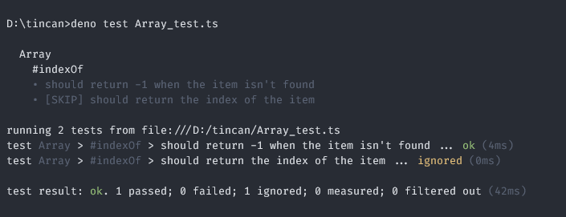

<p align="center">
  
  <h1 align="center">tincan</h1>
</p>

<p align="center">A lightweight Jest-like testing library for Deno</p>

## Features

- Hooks (`beforeAll`, `afterAll`, `beforeEach`, `afterEach`)
- Nested suites / cases
- Colorful output
- Lightweight

## Running

```sh
deno run <file>
```

```sh
deno test -q
```

## Usage

```ts
import {
  beforeEach,
  describe,
  expect,
  it,
  run,
} from "https://deno.land/x/tincan/mod.ts";

describe("Array", () => {
  let array: number[];

  beforeEach(() => {
    array = [];
  });

  describe("#indexOf", () => {
    it("should return -1 when the item isn't found", () => {
      expect(array.indexOf(0)).toBe(-1);
    });

    it("should return the index of the item", () => {
      array.push(0);
      expect(array.indexOf(0)).toBe(0);
    });
  });
});

run();
```
